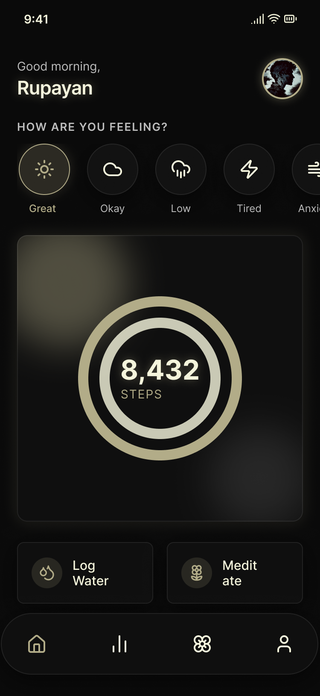
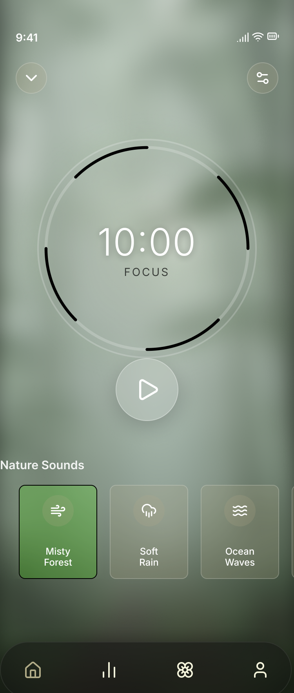
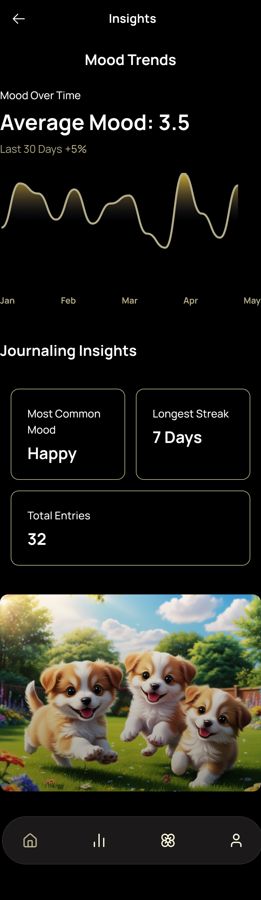
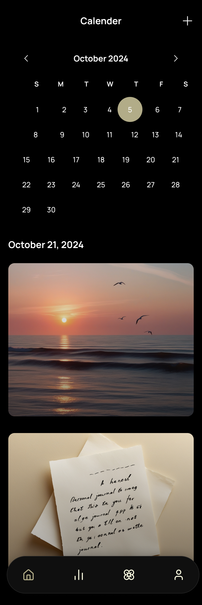
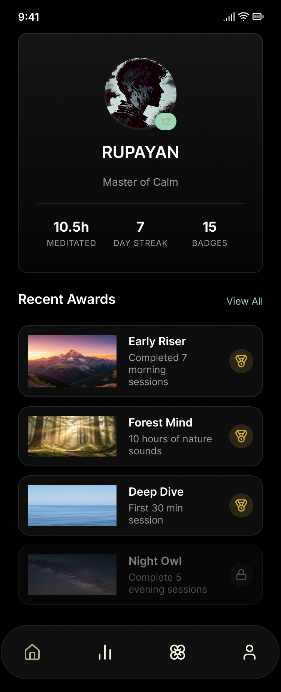

# Aevum: Mindfulness for the Modern Era
> **Task 2: Future Interns UI/UX Design Internship**

**Aevum** is a premium, high-fidelity mental wellness application designed to simplify the journey toward clarity and habit-building. By merging deep data analytics with a "Zen-inspired" aesthetic, the app provides a focused, immersive experience.

---

## 📱 Project Showcase

### 1. Splash Screen
A minimal gateway featuring the Aevum infinity logo to establish immediate clarity and brand identity.

### 2. Home Dashboard
A personalized hub featuring an interactive mood selector and a prominent, glowing circular step tracker.

### 3. Wellness Statistics
A data-rich view using vertical bar charts for movement and smooth line graphs to track sleep quality and heart rate.

### 4. Meditation Immersion
A distraction-free timer with integrated nature soundscapes and a rhythmic focus pulse.

### 5. Mood Trends & Insights
Deep-dive analytics that visualize mood fluctuations over time and summarize journaling streaks.

### 6. Journaling & Calendar
A structured view for navigating past sessions and reviewing personal journal entries.

### 7. Profile & Achievements
A gamified summary of milestones featuring metallic awards to incentivize personal growth.

---

## 🎨 Visual Identity
* **Aesthetic:** High-fidelity Glassmorphism with deep background blurs.
* **Palette:** Deep Charcoal (#121212) with Sage Green (#B2AC88) accents.
* **Workflow:** Designed on a trackpad using Figma and Jitter.

---

**Designed with 💚 by Rupayan**
*Student at RCC Institute of Technology (RCCIIT) | UI/UX Design Intern at Future Interns*
